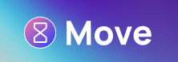

  

<h1 align="center">
   Move App, Landing Page
</h1>

Design of a health application landing page, where the design was taken from a free template from the Framer platform, it is a modern and attractive website, built with the latest web technologies. The page is focused on encouraging people to monitor their physical activities, improve their quality of life and convince visitors to install the app.

The page is developed with TypeScript, Vue.js and Vite, ensuring a clean and organized code. The UI is designed using the CSS framework, TailwindCSS, to create a modern, consistent and responsive design across all platforms.

To animate the page's elements, Anime.js, an animation JavaScript library that lets you easily create smooth, custom animations, was used. And to detect when a page element is visible, the Intersection Observer API was used, a browser API that allows monitoring when an element is displayed in the user's viewport.

The landing page is optimized to provide a great user experience, loading quickly and being easily navigable. It's a great way to encourage people to take care of their health and well-being.

## :hammer_and_wrench: Tools

* TypeScript
* Vue.js
* Vite
* TailwindCSS
* Anime.js
* Intersection Observer API

## :mailbox_with_mail: Utilities

### Vue.js

Vue.js is a progressive framework for building user interfaces. It was developed in 2014 by Evan You and is currently one of the most popular JavaScript frameworks along with React and Angular.

The main feature of Vue.js is its progressive approach, which means that you can gradually start using it in an existing project, or create a complete application with it. Vue.js can be used to build web applications of any size, from small widgets to large-scale applications.

Vue.js is component-based, which means you can create small, reusable blocks of code that can be combined to build more complex pages. Vue.js uses a declarative templating system to render the UI, which makes component creation and UI development much easier than with other JavaScript frameworks.

Another feature of Vue.js is its simplicity and ease of learning. It uses a simple and intuitive syntax that is easy to understand, and it comes with complete documentation and an ecosystem of plugins and libraries to help you build your application faster and more efficiently.

In addition, Vue.js has an active and growing community, which means there are many resources available to help you solve problems and improve your skills.

In short, Vue.js is a flexible, scalable, and easy-to-learn JavaScript framework that lets you create well-structured, reusable user interfaces.
 
### <strong>Intersection Observer API</strong>
 
The Intersection Observer API is a JavaScript feature that allows observing changes in the intersection of HTML elements with the browser viewport. This API was introduced to solve performance problems, since previously the detection of intersections was done using the getBoundingClientRect() method, which was called on each page scroll, which could hurt performance on pages with many elements.

With Intersection Observer, you can observe whether an element is visible in the browser window or not, and then take actions based on that information, such as adding CSS classes, starting animations, or loading additional content on demand.

The API is based on an IntersectionObserver object, which is instantiated with a callback function that will be executed whenever there are changes in the intersection of observed elements. This object is then used to observe one or more HTML elements, and the callback is triggered whenever there is any change in the intersection, such as when an element enters or leaves the user's view.

In summary, the Intersection Observer API is a powerful tool for observing changes in the intersection of HTML elements with the browser window, allowing the creation of dynamic and interactive features without sacrificing page performance.

### <strong>Anime.js</strong>

Anime.js is a lightweight and powerful JavaScript animation library that lets you create custom animations easily and efficiently. It offers a variety of features for creating sophisticated animations, including multi-target support, color animations, Bézier curves, CSS animations, SVG animations, and much more.

One of the main advantages of Anime.js is its simple and readable syntax, making creating animations more intuitive and easier to understand. The library is also highly customizable, allowing you to adjust speed, duration time, number of iterations, and more.

Furthermore, Anime.js is compatible with most modern browsers, making it a viable choice for web projects. The library can be easily integrated into Vue.js, Angular, React and other frameworks projects.

In short, Anime.js is a powerful and highly customizable tool for adding dynamic and interactive animations to web projects, making the user experience more attractive and engaging.

### <strong>Framer</strong>

Framer is a design and prototyping tool for apps and user interfaces that lets you create complex interactions and animations with ease. It is based on JavaScript, offering a wide range of features to create realistic prototypes, custom animations, reusable components and much more.

One of the main advantages of Framer is its intuitive visual interface, which allows you to create animations and interactions without the need to write code. However, Framer also supports writing custom code to create more advanced and custom animations.

Framer offers a wide range of resources and libraries to help designers and developers create rich and engaging user interfaces. Additionally, it lets you export designs and prototypes to CSS, JavaScript, and React code, making it easy for developers to integrate these features into their projects.

Although Framer is a paid tool, its intuitive interface and advanced features make it a popular choice for designers and developers who want to create sophisticated and engaging user interfaces.

Project made with :blue_heart: by <a href="https://github.com/stardusteight-d4c">Gabriel Sena</a>, design reference/design by <a href="https://www.youtube.com/channel/UCTIhfOopxukTIRkbXJ3kN-g" target="_blank">DesignCode</a> and <a href="https://www.framer.com" target="_blank">Framer</a>

